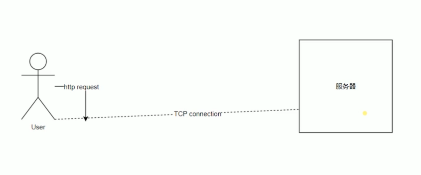

#网络协议分层
## 经典五层模型
* 应用层        为应用软件提供了很多服务 构建于TCP协议之上 屏蔽网络传输相关细节
* 传输层        向用户提供可靠的(End-to-End)端到端的服务  传输层向高层屏蔽了下层数据通信的细节
* 网络层        数据在结点之间传输创建逻辑链路(IP地址)
* 数据链路层    是在通信的实体间建立数据链路连接(mac地址)
* 物理层        主要作用是定义物理设备(光缆、光纤、网卡、端口等)如何传输数据

计网的目的是通信，是为了连接端到端 所以我们首先要考虑——网怎么设计
我们有两种网：1.分组交换 ；2.电路交换（电话）
在很久很久以前，你记不记着，有个“拨号连接”，有个叫做“猫”的东西？？？ 没错，就是那个，
一上网就打不了座机的时代 此时，我们还是电路交换哟
这样太蠢了！！！ 如果我只是想上网看下小电影的简介，那我打开介绍小电影的网站，就暂时不
会再通信了 所以，没必要一直给我连接着啊！
于是，我们用起了分组交换 分组交换还有两种方式： 1.虚电路，如ATM（模拟电话线路）；2.数据报，如因特网
>为啥因特网不用虚电路？ 肯定是因为，大多数时候，虚电路没必要啊，而且麻烦不好用啊
>为啥虚电路没必要&不好用？ 因为大多数时候，互联网没有实时要求啊，&他的面向连接浪费资源啊
好嘞，现在我们知道了，因特网使用的是，数据报 我们先不管数据报是什么，我们先考虑下如何传输数据报
-----------------------------------------
我们的因特网，肯定是基于物理电路的， 因此，我们需要一个，将数据转化为物理信号的层， 于是，物理层诞生啦
----------------------------------------
有了处理物理信号的物理层，可我们还得知道，信号发给谁啊 你肯定知道，每个主机都有一个，全球唯一的MAC地址吧 所以，我们可以用MAC地址来寻址啊 恭喜你，链路层诞生啦
----------------------------------------
别急，你知道MAC地址，是扁平化的吧 也就是说，MAC地址的空间分布，是无规律的！！！ 如
果你有十万台主机，要通过MAC地址来寻址 无F**K可说， 不管你设计什么样的算法，数据量都
太大了！！！ 所以，我们需要IP地址啊 <PS,IP里的有趣的东西太多啦，所以我补充在了最后> 有
了IP地址，恭喜你，网络层诞生啦
----------------------------------------
然而，一台主机不能只和一台服务器通信啊， 毕竟下小电影，也要同时货比三家啊 那如何实现并
行通信呢？ 嘿嘿，我们有端口号啊
再基于不同需求： 有人想要连得快，不介意数据丢失，比如你的小电影 有人必须要数据可靠，比
如发一个电子邮件 于是产生了UDP&TCP 恭喜你，传输层诞生啦
----------------------------------------
别急，你知道的吧，不同应用，有不同的传输需求 比如，请求网页，发送邮件，P2P... 而且，还
有DHCP服务器啊 为了方便开发者，我们就对这些常用需求，进行了封装 恭喜你，应用层诞生啦
至此，自底向上，讲述了计网。 待我考完试，我可以写一部，计算机网络·从下向顶方法 
----------------------------------------
<细节补充> >来我们思考先一个问题：如果有四台电脑，要互相能通信，咋办？
>每一台电脑都和另外三台连起来？ 那我要是再来十台电脑，你在电脑上给我再加十个接口？
>那，把他们连接到一个小盒子上，让小盒子帮着通信？ 哎这个可以有啊，那如果我有一万台电脑，一个小盒子能够用？
>嘿嘿，那让每一个小盒子连一百台，然后把一百台小盒子再连给一个小盒子
//
----------------------------------------
我们可以用“电话线，宽带，和光纤”，把电脑接给小盒子，它们被称作“接入网” 而ISP就像小盒
子，帮你在网络里做通信 而ISP的分层，无非就是，终端太多了，没办法不分层
好了，现在你已经明白了网络的层次化
你肯定是知道， 为了在辣么多计算机里，找到目标，我们采用了，有规律的IP地址 而路由器，又
叫分组交换机，就是帮我们在公网里，做IP寻址的
最初，IP地址是IPv4 首先，IP地址是分成了五类（ABCDE）奈何不够用啊，于是，我们是使用了子网划分 然鹅，手动分配子网IP，会死人的！ 于是，DHCP来了
md还是不好用啊，于是，诞生了无分类编址（CIDR） 奈何，还是不够用啊 于是，NAT出现啦，于是专用网的IP不再占用公网IP
----------------------------------------
>首先，啥是专用网啊 1.局域网，比如，公用一个路由器的宿舍啊，家啊 2.部分广域网，比如军
队、铁路、交通、电力等部门，拥有自己专用的通信网和计算机网。然鹅，这些网络不对内部外
的用户开放。这些网络覆盖的地理范围很广，因此，这些专用网都是广域网。
保密性质的广域网，通信要扯到VPN，宝宝没学到这里，先埋个坑
----------------------------------------
来我们先谈谈局域网内的通信： 如果哈，我们是一个大局域网，比如我们公司有一百台电脑， 首先，路由器没一百个接口让我插！ 其次，如果我不想和公网通信，那我就没必要用路由器！ 所以，链路交换机来了！！！
链路交换机是基于MAC寻址的，因为局域网没大到必须用IP寻址的地步啊 但更准确的说话，链路交换机采用了，跨越链路层和网络层边界的协议——ARP 毕竟，ARP要做一个IP到MAC的映射
----------------------------------------
>你问我，为啥ARP要做IP到MAC的映射 因为，你在应用层和运输层里，目的地址都写得是IP, 不把IP转化为MAC，咋寻址啊？
>你问我，局域网为啥不用路由器，为啥要用链路交换机 交换机功能少，接口多，比路由器划算啊
>那，局域网和公网怎么通信呢? 所以，NAT来了啊！！！
分组交换机，也就是路由器，用自己的公网IP，帮你们局域网里的人们，给公网发信息 然后把接受到的信息，再转发给，那个找他帮忙的人 这就是NAT技术啊混蛋！！！
----------------------------------------
这时一群人说，NAT bulabula不好，我们要拒绝NAT,使用IPv6 那么就牵扯到了IPv4和IPv6间的通信（双栈||隧道）
还有啊，IP地址太丑啦，用户根本记不住 http://xxx.xxx.xxx.xxx 于是乎，域名千呼万唤始出来 顺便带出来了DNS服务器
----------------------------------------
来源：https://www.zhihu.com/question/19718686

## 发展历史

### HTTP/0.9

* 只有一个命令GET
* 没有HEADER等描述数据的信息
* 服务器发送完毕，就不关闭TCP链接

### HTTP/1.0

* 增加了很多命令
* 增加status code 和 header
* 多字符集支持，多部分发送、权限、缓存等

### HTTP/1.1

* 持久链接
* 增加了pipeline
* 增加host和其他一些命令

### HTTP/2

* 所有数据一二进制传输
* 同一个连接里面发送多个请求不再需要按照顺序来
* 头信息压缩以及推送等提高效率的功能

## HTTP三次握手

用户发起请求的时候需要创建一个TCP connection链接，因为HTTP本身不存在连接这么一个概念，只有请求和响应的概念，请求响应需要数据包，需要请求的通道，那么这个通道就在这个connection里面了。另外这个connection是可以发送多个请求的，在1.0中创建之后发送请求，响应完之后就关闭了，而1.1之后可以通过申明让该connection一直保持着，好处就是省去了创建连接的三次握手。也就是说connection的创建需要三次握手。
在2.0中这个connection发送的请求可以是并发的。

SYN(synchronous): 标志位 表示这是一个创建请求的数据包
Seq(Sequence): 后面一般来说是1 
ACK(acknowledgement)=X+1 

为何要三次握手，为了服务端防止开启一些无用的连接

在TCP层，有个FLAGS字段，这个字段有以下几个标识：SYN, FIN, ACK, PSH, RST, URG.
其中，对于我们日常的分析有用的就是前面的五个字段。
它们的含义是：
SYN表示建立连接，
FIN表示关闭连接，
ACK表示响应，
PSH表示有 DATA数据传输，
RST表示连接重置。
其中，ACK是可能与SYN，FIN等同时使用的，比如SYN和ACK可能同时为1，它表示的就是建立连接之后的响应，
如果只是单个的一个SYN，它表示的只是建立连接。
TCP的几次握手就是通过这样的ACK表现出来的。
但SYN与FIN是不会同时为1的，因为前者表示的是建立连接，而后者表示的是断开连接。
RST一般是在FIN之后才会出现为1的情况，表示的是连接重置。
一般地，当出现FIN包或RST包时，我们便认为客户端与服务器端断开了连接；而当出现SYN和SYN＋ACK包时，我们认为客户端与服务器建立了一个连接。
PSH为1的情况，一般只出现在 DATA内容不为0的包中，也就是说PSH为1表示的是有真正的TCP数据包内容被传递。
TCP的连接建立和连接关闭，都是通过请求－响应的模式完成的。

概念补充-TCP三次握手：
TCP(Transmission Control Protocol)传输控制协议
TCP是主机对主机层的传输控制协议，提供可靠的连接服务，采用三次握手确认建立一个连接：
位码即tcp标志位，有6种标示：SYN(synchronous建立联机) ACK(acknowledgement 确认) PSH(push传送) FIN(finish结束) RST(reset重置) URG(urgent紧急)Sequence number(顺序号码) Acknowledge number(确认号码)
第一次握手：主机A发送位码为syn＝1，随机产生seq number=1234567的数据包到服务器，主机B由SYN=1知道，A要求建立联机；
第二次握手：主机B收到请求后要确认联机信息，向A发送ack number=(主机A的seq+1)，syn=1，ack=1，随机产生seq=7654321的包；
第三次握手：主机A收到后检查ack number是否正确，即第一次发送的seq number+1，以及位码ack是否为1，若正确，主机A会再发送ack number=(主机B的seq+1)，ack=1，主机B收到后确认seq值与ack=1则连接建立成功。
完成三次握手，主机A与主机B开始传送数据。
在TCP/IP协议中，TCP协议提供可靠的连接服务，采用三次握手建立一个连接。
第一次握手：建立连接时，客户端发送syn包(syn=j)到服务器，并进入SYN_SEND状态，等待服务器确认；
第二次握手：服务器收到syn包，必须确认客户的SYN（ack=j+1），同时自己也发送一个SYN包（syn=k），即SYN+ACK包，此时服务器进入SYN_RECV状态；
第三次握手：客户端收到服务器的SYN＋ACK包，向服务器发送确认包ACK(ack=k+1)，此包发送完毕，客户端和服务器进入ESTABLISHED状态，完成三次握手。完成三次握手，客户端与服务器开始传送数据.

## URI URL URN
